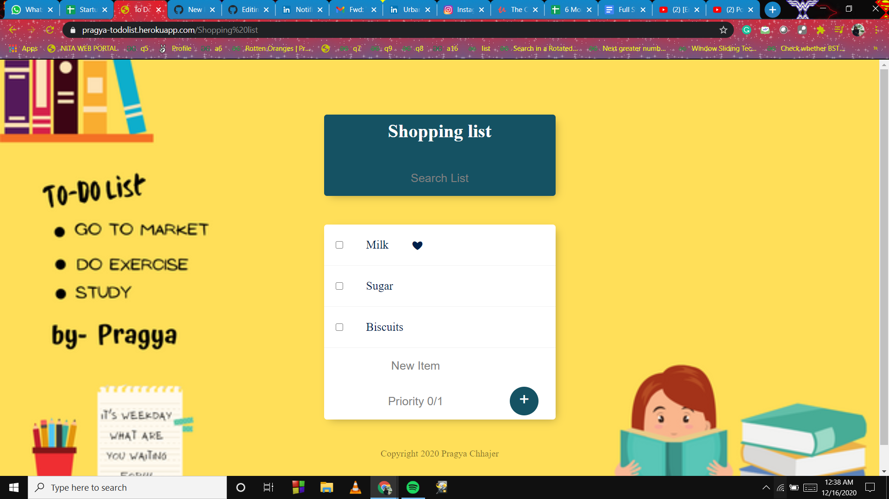

# ToDo List

## Prerequisites / Dependencies
    "body-parser": "^1.18.3",
    "ejs": "^2.6.1",
    "express": "^4.16.3",
    "lodash": "^4.17.19",
    "mongoose": "^5.9.23"
    
## Techstack Used
    Frontend:  HTML, CSS, EJS Templating
    Backend:  NodeJs 
    Database:  MongoDB
    Hosted:  Local server Port 3000 and on Heroku app Deployment

## Priortising the task

To add the enter the task. When task is completed you can delete the task by clicking on the checkbox on the left of the task.To make task on the list as priority put value priority 1 and a heart appears in the right of task showing that it is priority task.

## Searching the task

## To make different list

To make different list add "/name-of-list" at the end of the url.

## Click the below icon to visit my GitHub & LinkedIn profile.

[1]: https://www.github.com/Pragya0810
[2]: https://www.linkedin.com/in/pragya-chhajer-5a5aa6159/

---
[][1][][2]
---
